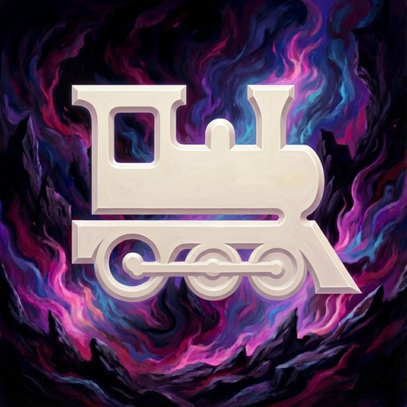

<p align="center">
  
</p>

<h1 align="center">Auto Hunt Train</h1>

<p align="center">
  <a href="https://discord.gg/hppkAvdBEE"></a>
  <a href="https://github.com/XeldarAlz/FFXIV-AutoHuntTrain/releases/latest"></a>
  <a href="https://github.com/XeldarAlz/FFXIV-AutoHuntTrain/releases"></a>
  <a href="https://github.com/XeldarAlz/FFXIV-AutoHuntTrain/actions/workflows/release.yml"></a>
  <a href="LICENSE.md"></a>
</p>

<p align="center">
  <em>Hunt trains, ridden for you. Built on Dalamud.</em>
</p>

---

## What it does

Hears a hunt train being called anywhere in your region, gets your character to the start aetheryte on that world, follows the conductor's flags from mark to mark, and lands a hit on every A rank before the crowd deletes it. With no feed installed it still follows a conductor you pick on your current world.

> In development. The scaffold is in place and the ride logic lands phase by phase; the first release is 1.0.0.0.

## Features

- **Rides announced trains**: subscribes to the HuntAlerts feed for train announcements across every data center in your region, with a countdown and a Ride button for each.
- **Ride rules**: choose expansions, data centers and worlds, whether cross-data-center rides are allowed, and how much lead time a train needs before the plugin commits.
- **Gets you there**: world change, data center travel and instance switching through Lifestream, then the plugin's own teleport and flight to the start aetheryte.
- **Follows the conductor**: reads the conductor's map flags from Shout, Yell and Say, picks the nearest aetheryte or flies when the flag is close, and understands instance numbers.
- **Finds the conductor**: from the announcement when it names one, from the first flag posted in the start zone, or picked by hand.
- **Hits, never leads**: dismounts at range, waits for the conductor's pull, lands a hit on the zone's A rank for credit, and never starts a pull or drags adds into the crowd.
- **Knows when it's over**: ends the ride when the conductor calls it, the expected marks are credited, or the flags stop.
- **Way home**: return to your home world after the train, stay for the next one, or run the after-ride action.
- **Recovery**: gets back up after a death and rejoins the train; re-paths, jumps, or teleports out when it gets stuck.
- **Auto-repair**: Dark Matter first, Grand Company mender as fallback.
- **Auto-consume**: keeps food and medicine buffs up between trains, HQ first.
- **Humanizer**: takes random breaks between trains so long sessions look less mechanical.
- **Pause & resume**: park a ride without losing your progress, and auto-pause while you're in a duty.
- **Party invites**: auto-declines incoming invites during a ride after a random delay, with an optional reply message.
- **GM alert**: stops the bot when a GM is near, with optional toast, beeps, or custom commands.
- **History**: every train recorded with world, data center, marks credited, time on the rails, and seals earned.

## Install

In-game: `/xlsettings` → **Experimental** → paste into **Custom Plugin Repositories**:

```
https://raw.githubusercontent.com/XeldarAlz/DalamudPlugins/main/repo.json
```

Tick **Enabled**, click **+**, then **Save and Close**. Open `/xlplugins` → **All Plugins**, search for **Auto Hunt Train**, and install.

The plugin needs a few helpers for movement, combat and travel to be installed and loaded, and HuntAlerts if you want announced trains. Open `/aht deps` after install to see the list and one-click each missing one. Data center rides also need data center travel enabled in Lifestream's own settings.

## Commands

| Command | Action |
|---|---|
| `/aht` | Toggle the main window |
| `/hunttrain` | Alias for `/aht` |
| `/aht config` | Open the Settings page |
| `/aht stats` | Open the History page |
| `/aht deps` | Open the Plugins page |
| `/aht log` | Open the Console page |
| `/aht changelog` | Open the Changelog page |
| `/aht about` | Open the About page |
| `/aht pause` | Pause or resume the current ride |
| `/aht target` | Log targeted NPC's BaseId (debug helper) |
| `/aht goto <territory> <x> <y> <z>` | Travel to a point, `/aht goto stop` cancels (debug helper) |
| `/aht goto <world> [<aetheryte>] [i<n>]` | Travel to a world in your region, and on it to a named aetheryte and instance, e.g. `/aht goto Zalera Wachunpelo i2` (debug helper) |
| `/aht goto home` | Travel back to your home world (debug helper) |

## Languages

The windows are available in English, Deutsch, Français, Español, Português (Brasil), Русский, Türkçe, 日本語, and 中文. The plugin picks a language from your Dalamud and game client settings on first launch; change it any time under Settings, General, Language. Game data such as zone, mark, and world names always follows the game client.

Spotted a wrong or awkward translation? Open a [translation issue](https://github.com/XeldarAlz/FFXIV-AutoHuntTrain/issues/new?template=translation_report.yml) and tell me what it should say instead.

## Community

Questions, ideas, or just want to hang out with other players? Come say hi on Discord.

→ [Join our Discord](https://discord.gg/hppkAvdBEE)

## More from me

If you liked this plugin, take a look at my other Dalamud work. You might find something else there for you.

→ [XeldarAlz Dalamud Plugins](https://github.com/XeldarAlz/DalamudPlugins)

## License

AGPL-3.0-or-later. See [LICENSE.md](LICENSE.md). [NOTICE](NOTICE) adds the attribution terms the AGPL allows: a fork, or any project that reuses this code, must credit the original author and must not pass itself off as the original. The license covers the code, not the name or the icon: read the [trademark and naming policy](TRADEMARK.md) before you publish a fork.

How AI is used to build this plugin is written down in [AI usage](AI-USAGE.md).
